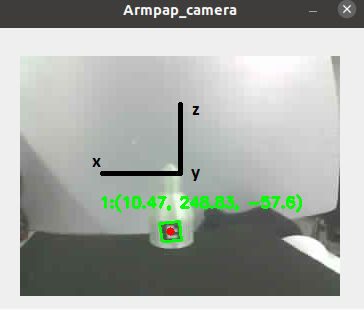

# Wifi_camera_M5_Ros
application example M5 Timer Camera wifi + Ros + Opencv (Aruco) 


## Description ##

Example module of how to use the M5 Timer Cam to install on robots or where required and include it in our ROS system.


## Key concepts covered ##
- Capture the image using Threads
- Display the image using Threads
- Publish the compressed image using ROS
- Detect information from the image using the aruco library
- Receive the image via Ros and display it

## Usage ##

The Camera i'm using for this example in the M5 Timer Camera F model, more info [Here](https://docs.m5stack.com/en/unit/timercam_f).

I have been using the camera program that comes as an example in the arduinon ide "web_cam". As a change define what resolution you want. After this you will get the IP assigned to your camera, simply connect the camera to the PC and using the Arduino Ide monitor you will get the IP where it is hosted.


The camera has two modes of operation: 
- Capture  ("http:// 192.168.0.XXX/capture) 
- Streaming ("http:// 192.168.0.XXX/stream)

I have not been able to use streaming, so the example I use is with capture. This forces the capture image to be updated before reading it, otherwise we will only get a frame. 

```ruby
  # "normal" usage
  cap = cv2.VideoCapture(0) # pc camera
  while not rospy.is_shutdown():
    ret, frame = cap.read()
    ...

 ``` 
 ```ruby
  # capture mode usage
  while not rospy.is_shutdown():
    cap = cv2.VideoCapture("http://192.168.0.xxx/capture") # M5 Timer Camera ip
    ret, frame = cap.read()
    ...

 ```
 
In cam_capture are defined the publication topics, the IP of the camera, if you do not modify the topics you should not have problems if you do so you will have to change it also in image_receiver.py 
 
 ## Instalation and test ##
 
 Download the camera_wifi folder inside the scripts folder of any ros module that you use rospy. Make sure the python files are executable if not change them using "chmod -x *.py". After That make catkin_make 
 - type "roscore" in a terminal
 - "python3 cam_capture.py" in another terminal inside camera_wifi folder or "rosrun myproject cam_capture.py"
 - To reconstruct and visualize the image sent by Ros type in another terminal "rosrun myproject Image_receiver.py"      
 
 
 ## Aruco modul ##
 In this example there are two applications by using the fiducials.
 - Detect the orientation of the fiducial
 - Detect the coordinates x,y,z (Position relative to the center of the image, X:horizontal, Z: vertical and Y:distance between the camera and the fiducial)
 
  
     
  
  
  
 


